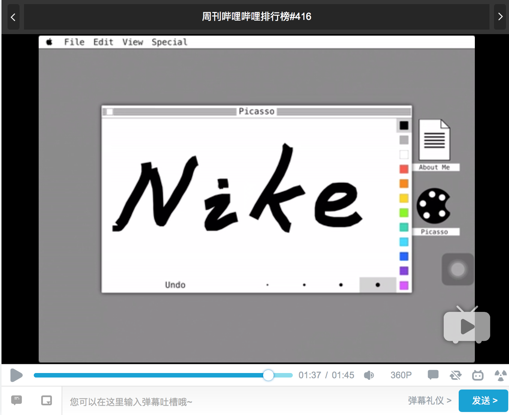
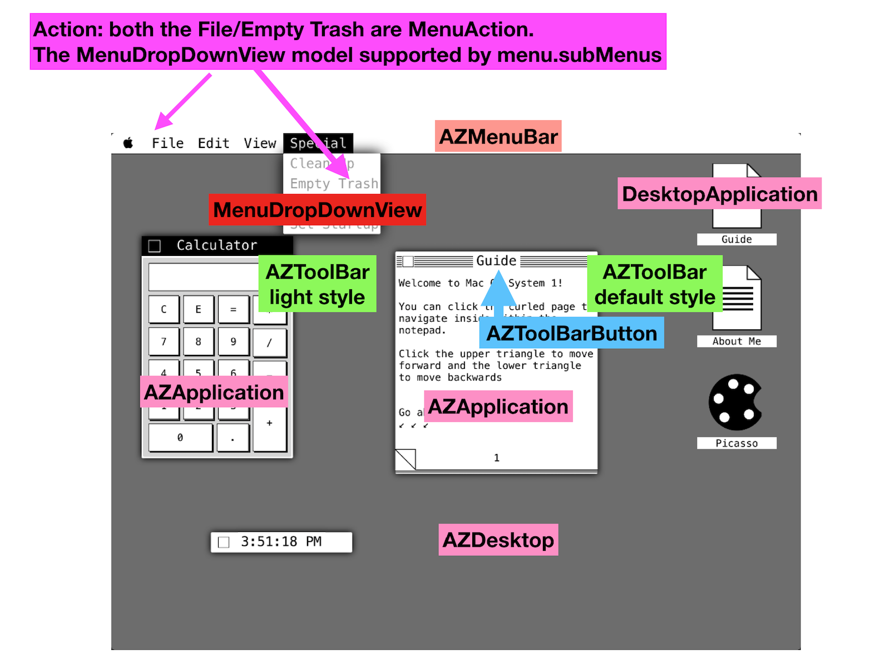

Sometime ago I met this terrific project on github: [The-Macintosh-Project](https://github.com/Minitour/The-Macintosh-Project). I was totally fascinated by this Project.

I want to know how does it work, Playground Project is cool, but won't it be cooler if I turn it into iPad/iPhone App. 

So I made it, below is the video I run this on my old iPad mini:

This project depends heavily on: delegate design pattern, create UI 
objects programticlly, frame-based layout.

I changed some of the class names, add the prefix AZ(stands for the author name [Antonio Zaitoun](https://github.com/Minitour)) because iOS has `window` object, modified some methods/property because of the language evolution and to better conform to the Swift API design guide.

Antonio Zaitoun already explains about the project. here I add some notes about the structure of the project: 

- MenuAction: struct, can be action/separator, has  subMenus, we use MenuAction to represent/draw both the dropDownMenu and Menubar.
- MacApp: protocol, Finder/Puzzle/Notes/Picasso… all Apps will conform to it.
- SystemSettings: constants, and we’ll change constants according to device.

---------

- AZToolBarButton(UIButton): simple square button inherits from UIButton.
- AZToolBar(UIView): draw the default/light style toolbar. protocol AZToolBarDelegate, func didSelectCloseMenu(_ toolBar: AZToolBar, toolButton button: AZToolButton) AZApplication will act as its delegate and implement this method.
- MenuDropDownView(UIView): protocol MenuDropDownDelegate func menuDropDown(_ menuDropDown: MenuDropDownView, didSelectActionAtIndex index: Int) , AZMenuBar will be its delegate and implement this method.

---------

- AZMenuBar(UIView): protocol AZMenuBarDataSource: func menuActions(_ menuBar: AZMenuBar) -> [MenuAction],  func osMenuActions(_ menuBar: AZMenuBar) -> [MenuAction] AZDesktop will act as its dataSource and implement these two methods.
- AZApplication(UIView): The MacApp lives in this, has container and toolbar, init(delegate: AZApplicationDelegate, dataSource: MacApp) init with AZApplicationDelegate(an AZDesktop object will conforms to this AZApplicationDelegate protocol), MacApp will act as its dataSource.
- AZDesktop(UIView): main soul of the App, will act as Application’s delegate and Menubar’s delegate. DesktopApplication delegate. 

--------
- MovingWindow(UIView): The application moving frame.
- MovingApplication(UIView): The desktop icon can be moved, this is its moving view. MovingApplication and MovingWindow very similar and use similar tricks deal with drag to move around. 
- MacAppDesktopView (UIView): The icon/image on desktop. init from DesktopAppDataSource. DesktopApplication conform to this delegate and provide the init for the view.
- DesktopApplication:  pure class, used to show/connect MacAppDesktopView and AZApplication.

--------

read more about the Macintosh in 1984, aka System 1:

- [GUIs about The Macintosh in 1984](http://toastytech.com/guis/macos1.html)
- [System 1](https://en.wikipedia.org/wiki/System_1)